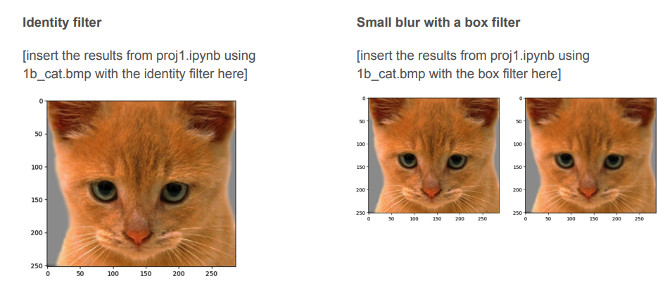
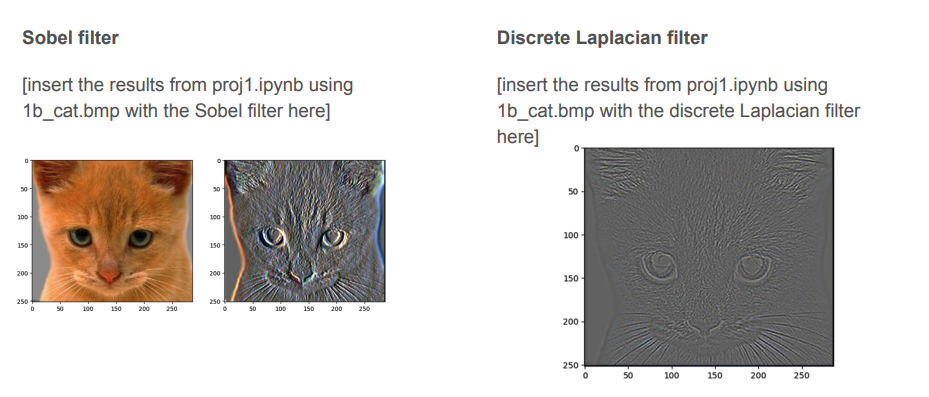
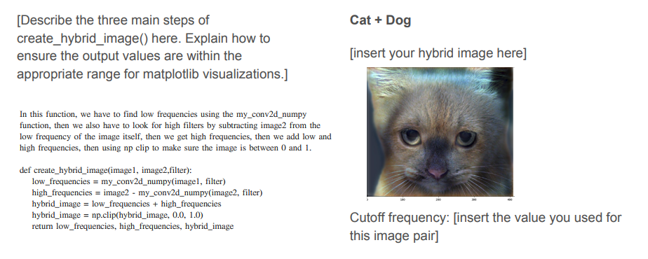
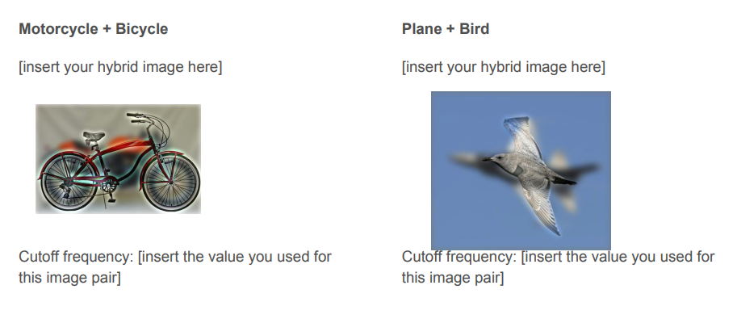
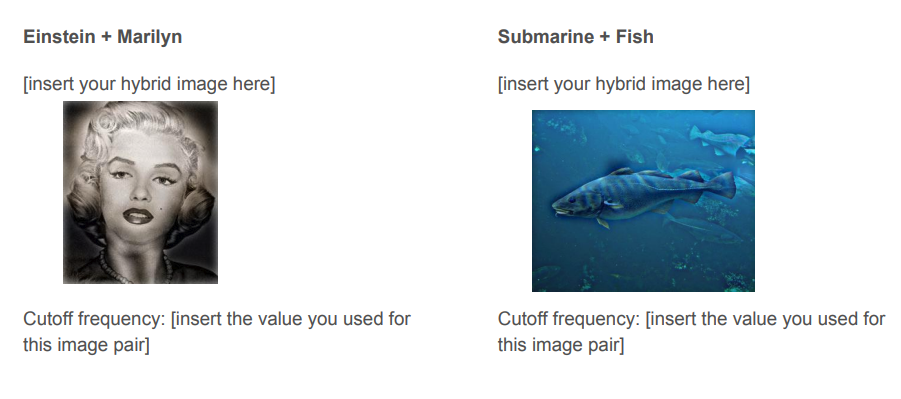
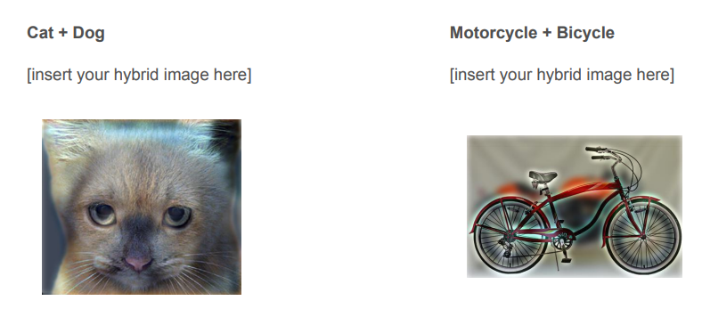
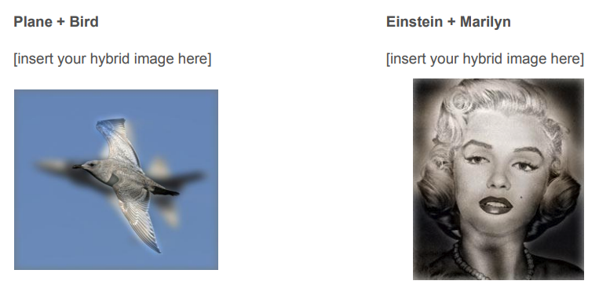
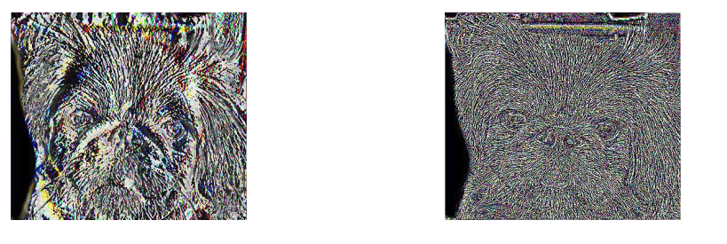

# Image Filtering and Hybrid Image Generation (HybridFilter)

## Overview

**Image Filtering and Hybrid Image Generation** is a comprehensive project that delves into key image processing techniques, including Gaussian filtering, sharpening, and edge detection. Additionally, the project introduces the concept of hybrid images, which combine both low- and high-frequency components from two distinct images. This results in an intriguing visual effect, where the images appear differently depending on the viewer's distance from the display.

This project serves as an introductory exploration into fundamental computer vision techniques and lays the groundwork for more advanced image processing tasks. It emphasizes the importance of frequency-domain filtering, convolutional filters, and hybrid image generation, offering a hands-on approach to implementing these techniques.

The project is divided into three distinct parts:
1. **Data Loading and Preparation**: Handling the input images, loading datasets, and pre-processing.
2. **Model Training and Image Processing**: Implementing the core image filtering and hybrid image generation techniques.
3. **Result Visualization**: Visualizing and saving the outcomes of the image processing pipeline.

## Project Structure

The project is organized into several files and directories, each focusing on specific tasks in the image processing pipeline:

### Core Code
- **`part1.py`**: Implements basic image filtering techniques, including Gaussian blur, sharpening, and edge detection.
- **`part2_datasets.py`**: Contains functions for loading, pre-processing, and preparing datasets for further processing.
- **`part2_models.py`**: Defines models and functions for combining images into hybrid images based on frequency-domain filtering.
- **`part3.py`**: Combines all components to generate hybrid images using the models defined in `part2_models.py`.
- **`utils.py`**: Utility functions for image manipulation, such as resizing, frequency transformation, and visualization.

### Test Cases
- **`test_part1.py`**: Unit tests for the image filtering functions (Gaussian blur, sharpening, edge detection).
- **`test_part2.py`**: Unit tests for dataset handling and pre-processing functions.
- **`test_part3.py`**: Unit tests for the hybrid image generation pipeline.
- **`test_utils.py`**: Unit tests for utility functions like image loading and saving.

### Results
The **`result/`** directory contains the generated images, including both the filtered and hybrid images. Below are the images showcasing the effects of different filtering techniques and hybrid image generation:

- **Image 1**: Example of an image with applied Gaussian blur.
- **Image 2**: Example of an image after applying sharpening filters.
- **Image 3**: Example of an image with edge detection applied.
- **Image 4**: Example of a hybrid image, created by combining high- and low-frequency components.
- **Image 5**: Another example of a hybrid image with different source images.
- **Image 6-8**: Additional examples of hybrid images created from various combinations.


*Gaussian Blur Applied*


*Sharpening Applied*


*Edge Detection Applied*


*Hybrid Image 1*


*Hybrid Image 2*


*Hybrid Image 3*


*Hybrid Image 4*


*Hybrid Image 5*

### Additional Files
- **`.gitignore`**: Specifies files and directories to be ignored by Git version control.
- **`LICENSE`**: MIT License for open-source distribution and use.
- **`README.md`**: This file, containing project documentation and setup instructions.
- **`cutoff_frequencies.txt`**: Contains the frequency cutoff values used in the hybrid image creation process for low- and high-pass filtering.
- **`proj1.ipynb`**: Jupyter Notebook for interactive execution of the entire image processing pipeline.
- **`setup.py`**: Setup script for installing necessary Python dependencies.

## Requirements

To run this project, ensure that you have the following Python libraries installed:

- **Python 3.x**: Programming language used to implement the project.
- **NumPy**: A fundamental package for scientific computing with Python.
- **OpenCV** (cv2): Open-source computer vision and machine learning software library.
- **Matplotlib**: A plotting library for the Python programming language and its numerical mathematics extension, NumPy.

To install the necessary dependencies, run the following command:

```bash
pip install -r requirements.txt
